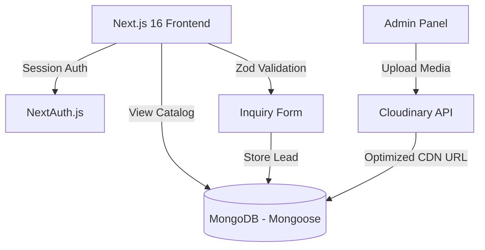

# 🚢 Delta Impex — Marine & Industrial Solutions Platform

[](https://deltaimpex.co)
[](https://github.com/Alfaz-17/delta-impex)
[](https://nextjs.org)
[](https://react.dev)
[](https://tailwindcss.com)
[](https://mongoosejs.com)

Delta Impex is an elite global portal displaying engineering excellence across maritime shipping parts and industrial desalination installations. Architected on a next-generation React framework, it provides clients with fluid catalog browsing, technical specs, and inquiry channels for global procurement.

---

## 🌟 Architectural Features & Design Patterns

### 1. ⚙️ Dual-Vertical Industrial Architecture
The platform is custom-engineered to segment and present Delta Impex's core operations:
* **Marine & Industrial Parts**: Detailed cataloging of high-precision components, including main propulsion systems, ship auxiliaries, diesel generators, and heavy gensets.
* **RO Plants & Desalination**: Focuses on advanced Reverse Osmosis (RO) systems, commercial desalination units, and related water treatment machinery.

### 2. 🎨 Premium Cinematic UI/UX (Framer Motion & Lenis)
* **Smooth Scrolling**: Integrates **Lenis** to provide a physics-based, consistent smooth-scrolling experience across modern browsers.
* **Micro-Animations**: Uses **Framer Motion** for state transitions, interactive card-reveal animations on hover, and canvas-based product views.
* **Dark Mode**: Utilizes `next-themes` and CSS variables to provide a polished, high-contrast dark theme adapted for technical engineers.

### 3. 🖼️ Cloudinary API & Image Optimization
* **Cloud Storage**: Admin assets, schematics, and product galleries are stored securely in **Cloudinary**, preventing server storage bottlenecks.
* **On-the-fly Optimization**: Images are compressed, resized, and delivered in high-efficiency `.webp` formats via Cloudinary transformations, boosting the page load speed.

### 4. 🔒 Secured Management Console (NextAuth)
* **Identity Management**: Protected admin endpoints using **NextAuth.js** to prevent unauthorized product and gallery configuration updates.
* **Validation Protocols**: Forms for lead generation and product inquiries utilize **React Hook Form** paired with **Zod schema validations** to ensure clean data entry.

---

## 🏗️ System Architecture



---

## 📂 Codebase Directory Structure

```bash
delta-impex/
├── app/
│   ├── about/            # Company philosophy & export history
│   ├── admin/            # Dashboard layout for product management
│   ├── api/              # API endpoints for product administration & auth
│   ├── contact/          # Global office directories and RFQ intake forms
│   ├── divisions/        # Product verticals (Marine Spares vs. RO Water Plants)
│   ├── gallery/          # High-resolution project photo galleries
│   ├── layout.tsx        # Layout definition (Themes, SmoothScroll)
│   ├── page.tsx          # Marketing landing page with division spotlights
│   └── sitemap.ts        # Dynamic sitemap provider
├── components/
│   ├── sections/         # Custom UI sections (Hero, Philosophy, Divisions)
│   ├── ui/               # Modular components (Buttons, inputs, cards)
│   ├── theme-provider.tsx# Light/Dark context wrapper
│   └── smooth-scroll.tsx # Lenis wrapper component
├── hooks/                # Custom React hook utilities
├── lib/                  # Database connectivity modules
├── models/               # MongoDB mongoose definitions
└── README.md
```

---

## 📊 Database Schema Design (Mongoose)

### **Product Schema**
```javascript
{
  name: { type: String, required: true, index: true },
  division: { type: String, enum: ['marine-industrial', 'ro-water'], required: true },
  description: { type: String, required: true },
  mainImage: { type: String, required: true }, // Cloudinary CDN Link
  gallery: [{ type: String }],
  features: [{ type: String }],
  technicalSpecs: {
    power: { type: String },
    dimensions: { type: String },
    capacity: { type: String },
    material: { type: String }
  },
  slug: { type: String, unique: true, index: true }
}
```

### **Gallery Schema**
```javascript
{
  title: { type: String, required: true },
  description: { type: String },
  imageUrl: { type: String, required: true }, // Cloudinary link
  division: { type: String, enum: ['marine-industrial', 'ro-water'] },
  createdAt: { type: Date, default: Date.now }
}
```

---

## 📡 API Reference

### Public API Endpoints
* **`GET /api/products`**: Fetch products (filterable by division: `marine-industrial` or `ro-water`).
* **`GET /api/products/:slug`**: Fetch details of a single product.
* **`POST /api/inquiries`**: Submit inquiries and RFQs.

### Admin API Endpoints
* **`POST /api/admin/products`**: Add a new product to the catalog (Admin Auth required).
* **`PUT /api/admin/products/:id`**: Update product specifications (Admin Auth required).
* **`DELETE /api/admin/products/:id`**: Remove a product from the database (Admin Auth required).

---

## ⚙️ Installation & Setup

### 1. Prerequisites
* Node.js (v18+)
* MongoDB connection URI
* Cloudinary API Credentials

### 2. Configure Environment Variables (`.env.local`)
Create a `.env.local` file in the root directory:
```env
MONGODB_URI="mongodb+srv://<username>:<password>@cluster.mongodb.net/deltaimpex"
NEXTAUTH_SECRET="your-nextauth-encryption-key"
NEXTAUTH_URL="http://localhost:3000"

# Cloudinary Integration
CLOUDINARY_CLOUD_NAME="your_cloud_name"
CLOUDINARY_API_KEY="your_api_key"
CLOUDINARY_API_SECRET="your_api_secret"
```

### 3. Run Locally
```bash
# Install dependencies
npm install

# Start Next.js development server
npm run dev
```
Navigate to [http://localhost:3000](http://localhost:3000) to view the portal.
